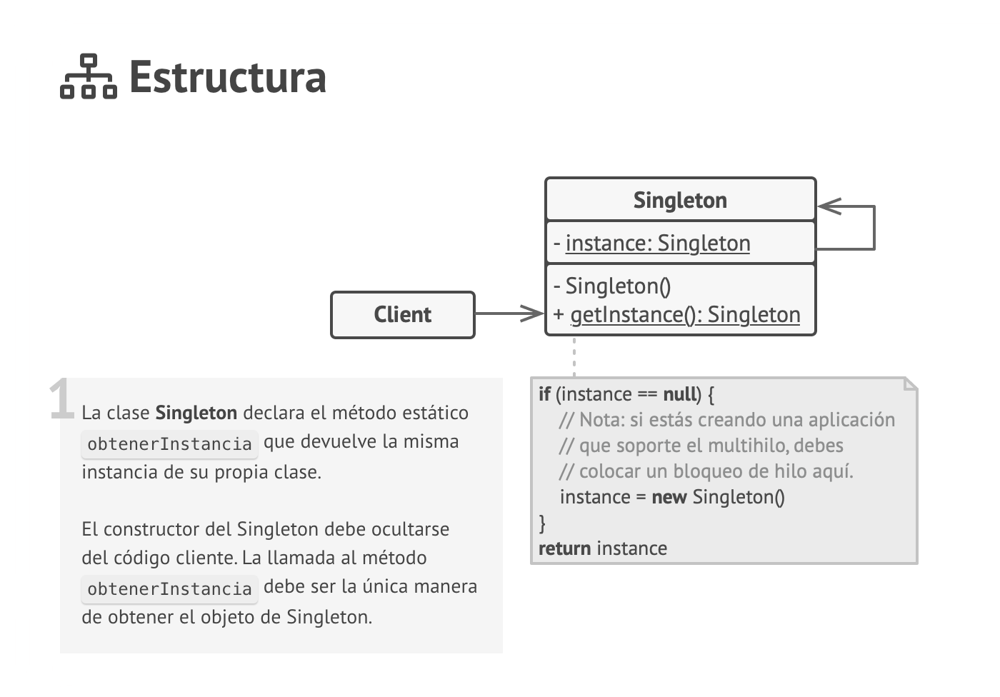

# Patterns 
##  Nivel 1 

### Singleton
Crea una classe que repliqui el funcionament del comando 'Undo'. Aquesta classe serà utilitzada per la classe Main, que
permetrà introduir opcions per consola.

La classe 'Undo' ha de guardar les últimes comandes introduïdes. Ha de permetre afegir o eliminar comandes, així com 
llistar les últimes comandes introduïdes (semblant a la comanda 'history' en Linux).
La classe 'Undo' ha d'implementar imprescindiblement un patró Singleton.

# Que es un Singleton

es un patrón de diseño creacional que nos permite asegurarnos de que una clase tenga una única instancia, a la vez que 
proporciona un punto de acceso global a dicha instancia.

Patron Singleton —>El patrón Singleton asegura que una clase tenga solo una instancia y proporciona un punto de acceso
global a esa instancia. Esto significa que solo se puede tener una instancia de esta clase en todo el programa. Para 
lograr esto, hay que hacer que el constructor de la clase sea privado y proporcionaremos un método estático para obtener
la única instancia existente.

###  Todas las implementaciones del patrón Singleton tienen estos dos pasos en común:

Hacer privado el constructor por defecto para evitar que otros objetos utilicen el operador new con la clase Singleton.

Crear un método de creación estático que actúe como constructor. Tras bambalinas, este método invoca al constructor privado 
para crear un objeto y lo guarda en un campo estático. Las siguientes llamadas a este método devuelven el objeto almacenado en caché.

Si tu código tiene acceso a la clase Singleton, podrá invocar su método estático. De esta manera, cada vez que se invoque 
este método, siempre se devolverá el mismo objeto.

### Analogía en el mundo real
El gobierno es un ejemplo excelente del patrón Singleton. Un país sólo puede tener un gobierno oficial. Independientemente 
de las identidades personales de los individuos que forman el gobierno, el título “Gobierno de X” es un punto de acceso 
global que identifica al grupo de personas a cargo.

Ver video 
### https://www.youtube.com/watch?v=osSJxXas3PM

